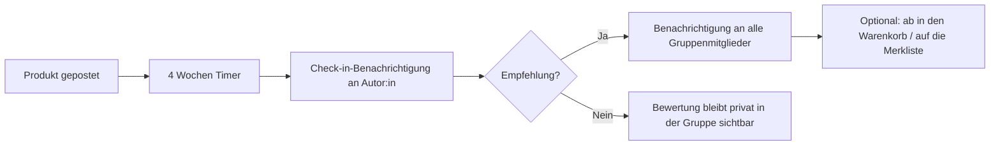

# babe recommended 💖

**Von Freund:innen empfohlen — weil ihr euch vertraut.**

*babe recommended* ist eine App, mit der Du und Deine Freund:innen Produkte teilt, die ihr euch gekauft habt — Skincare, Bodycare, Make-up, Lebensmittel, was auch immer. Nach vier Wochen fragt die App automatisch nach: Magst Du das Produkt? Wie bewertest Du es? Sprichst Du eine Empfehlung aus? Wird empfohlen, erfahren es alle in der Gruppe sofort — auf Wunsch landet das Produkt sogar direkt im Warenkorb.

## 🌟 Kernfunktionen

### 1. Gruppen mit Freund:innen
- Eine Gruppe erstellen und Freund:innen per Einladung (Link oder Code) hinzufügen
- Mehrere Gruppen möglich (z. B. „Skincare-Girls“, „Foodie-Crew“)

### 2. Produkte teilen
- **Produktsuche**: Produkt per Textsuche finden (Open Beauty Facts für Kosmetik/Pflege, Open Food Facts für Lebensmittel) — Name, Marke und Produktbild werden automatisch übernommen
- **Barcode-Scanner** 📷: Barcode scannen und das Produkt wird automatisch erkannt
- Alternativ manuell eingeben, eigenes Foto hinzufügen
- Kategorie wählen: Skincare, Bodycare, Make-up, Lebensmittel, Sonstiges
- Optional: Preis, Shop-Link, Notiz („erster Eindruck“)

### 3. Der 4-Wochen-Check-in ⏰
- Genau 4 Wochen nach dem Posten kommt eine automatische Benachrichtigung:
  - **Magst Du das Produkt?** (Ja / Nein)
  - **Bewertung** (1–5 Herzen)
  - **Empfehlung aussprechen?** (Ja / Nein) + optionaler Kommentar

### 4. Punkte & öffentliche Badges 🏅
- Markieren Freund:innen Deine Empfehlung als **„Hilfreich“ 💖**, bekommst Du **+10 Punkte**
- Punkteschwellen schalten öffentlich sichtbare **Badges** frei:
  - 💫 **Geheimtipp** (ab 10 Punkten)
  - 🌟 **Trendsetterin** (ab 30 Punkten)
  - 👑 **Empfehlungs-Queen** (ab 75 Punkten)
- Mit dem ersten Badge darfst Du Empfehlungen **öffentlich** im **Entdecken-Feed 🌍** posten — nicht nur in Deinen privaten Gruppen

### 5. Empfehlungen an die Gruppe
- Wird ein Produkt empfohlen, bekommen alle anderen Gruppenmitglieder automatisch eine Benachrichtigung: *„✨ Lisa empfiehlt: XYZ Vitamin-C-Serum (5/5)“*
- Optional: Das empfohlene Produkt wird per Shop-Link direkt in den Warenkorb bzw. auf die Merkliste der Freund:innen gelegt

## 🧱 Datenmodell (Entwurf)

| Entität | Felder (Auszug) |
|---|---|
| **User** | id, name, avatar, points, notification_settings |
| **Badge** | id, name, emoji, min_points (💫 10 / 🌟 30 / 👑 75) |
| **Group** | id, name, invite_code, members[] |
| **ProductPost** | id, group_id, author_id, foto, titel, marke, barcode, kategorie, preis, shop_link, created_at, review_due_at (= created_at + 4 Wochen), is_public, helpful_user_ids[] |
| **Review** | id, post_id, liked (bool), rating (1–5), recommended (bool), kommentar |
| **Notification** | id, user_id, typ (review_due / recommendation), payload, read |

## 🔁 Ablauf



## 🚀 MVP-Umfang (Phase 1)

1. Registrierung/Login
2. Gruppe erstellen + Freund:innen per Code einladen
3. Produkt mit Foto und Kategorie posten
4. Automatischer 4-Wochen-Check-in (Push/In-App)
5. Bewertung + Empfehlungs-Broadcast an die Gruppe

**Phase 2:** Warenkorb-/Merklisten-Integration (Shop-Links, Affiliate-APIs), Web-Version, Produkt-Suche in der eigenen Historie („Was hatte Mia nochmal empfohlen?“)

## 🛠 Tech-Stack

- **App:** React Native mit [Expo](https://expo.dev) (TypeScript) — **iOS-first**, Android läuft technisch mit
- **Produktdaten:** [Open Beauty Facts](https://world.openbeautyfacts.org) + [Open Food Facts](https://world.openfoodfacts.org) (Suche und Barcode-Lookup, kostenlos und ohne API-Key)
- **Barcode-Scanner:** `expo-camera` (EAN-13/8, UPC-A/E)
- **Backend (geplant):** z. B. Supabase/Firebase für Auth, Daten und den 4-Wochen-Scheduler; Expo Push Notifications für Benachrichtigungen

## ▶️ Prototyp starten

```bash
npm install
npx expo start
```

Dann mit der **Expo Go**-App (iOS/Android) den QR-Code scannen — oder `w` drücken für die Web-Vorschau.

**Prototyp-Hinweise:**
- Daten sind aktuell Mock-Daten im Speicher (`src/data.ts`) — kein Backend, kein Login.
- Der 4-Wochen-Check-in läuft in-App (Prüfung jede Minute). Bei eigenen Posts gibt es einen Demo-Button **„⏩ 4 Wochen simulieren“**, um den Check-in sofort auszulösen.
- Wird bei der Bewertung eine Empfehlung ausgesprochen, bekommen alle anderen Gruppenmitglieder eine Benachrichtigung (im Prototyp sichtbar unter 🔔).
